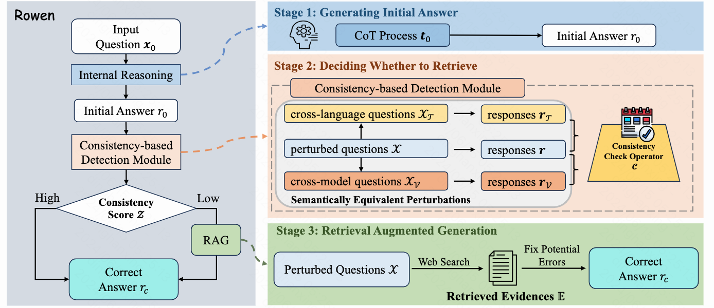
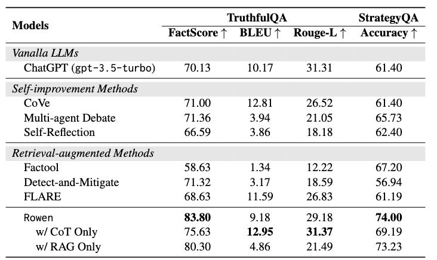

# Retrieve Only When It Needs: Adaptive Retrieval Augmentation for Hallucination Mitigation in Large Language Models

## About Rowen
We introduce a novel method, Rowen, a novel framework that enhances LLMs with a adaptive retrieval augmentation process tailored to address hallucinated outputs. This process is governed by a consistency-based uncertainty estimation module, which assesses the model's uncertainty regarding the input query by estimating semantic inconsistencies across different languages and models. Upon detecting high uncertainty on input questions, Rowen activates the retrieval of external information to rectify the model outputs.


## Requirements
- openai == 0.28.0
- [Serper Api Key](https://serper.dev/)
- [OpenAI Api Key](https://chat.openai.com)

## Usage
1. Run experiments on the TruthfulQA dataset

```bash
python run_truthfulqa.py --k 6 --threshold 0.6 --alpha 1.0 --qwen_model_name qwen-max-0428 --mode hybrid
```

2. Run experiments on the StrategyQA dataset

```bash
python run_strategyqa.py --k 6 --threshold 0.6 --alpha 1.0 --qwen_model_name qwen-max-0428 --mode hybrid
```

Generated responses and evaluation results will be saved automatically.

Please be careful, the experiments are relatively expensive because Rowen calls OpenAI API multiple times for a single question. You can decrease the `k` (number of pertubed questions) in the file to reduce the cost.

## Performance

